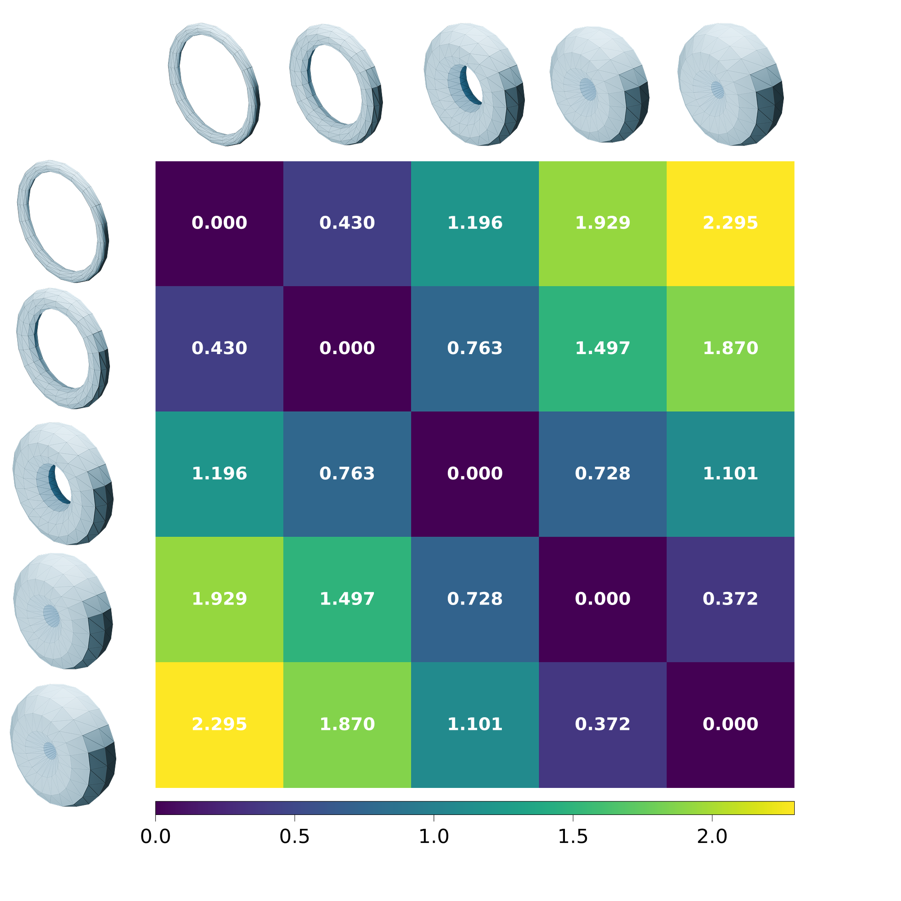
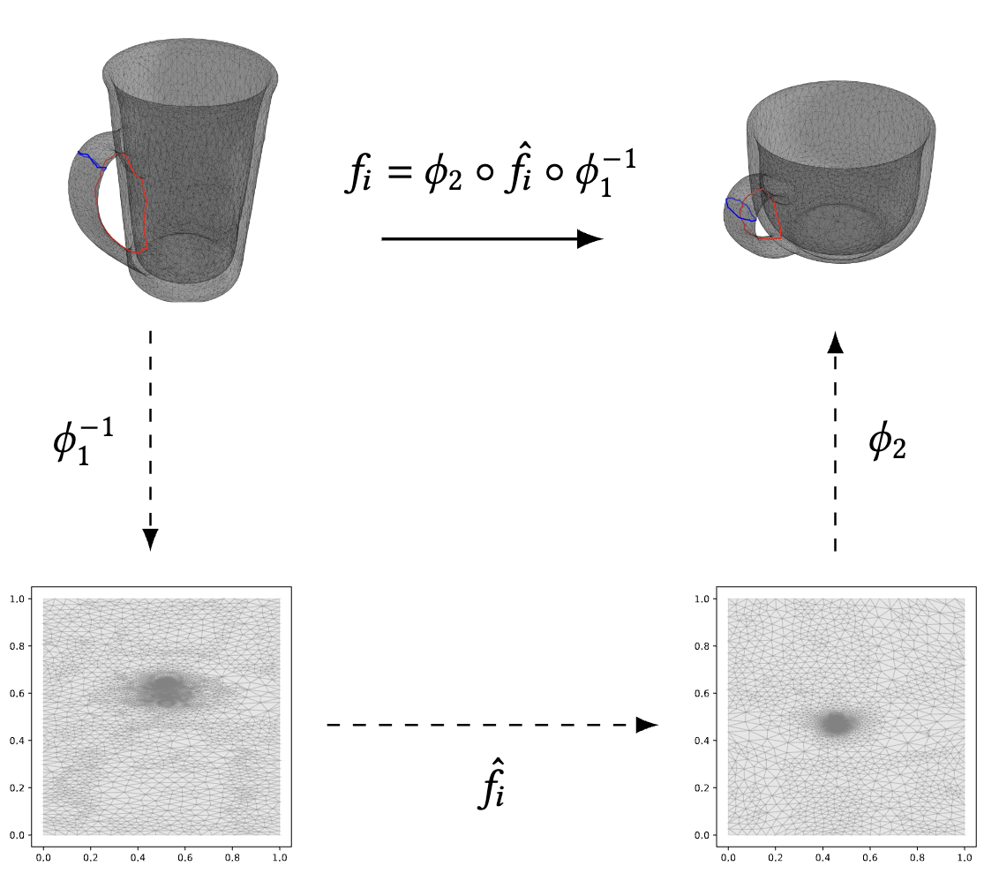
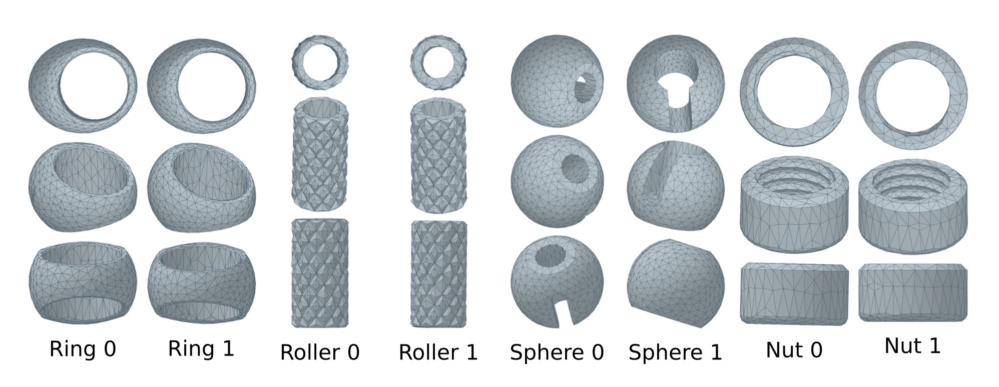
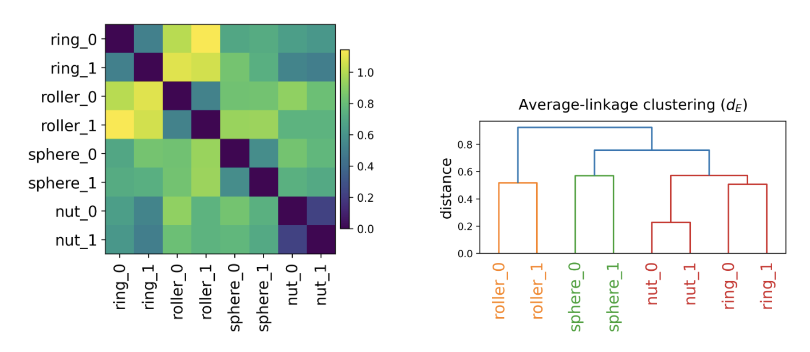

# Tori Comparison
Compare two triangulated tori without requiring landmarks or same triangulation/correspondence.

Experiments and reproducibility code for paper: "Computing a Metric on the Shape Space of Tori", to be appear in ACM Transactions on Graphics 2026. 

## Selected Results
We compute a pairwise distance matrix for five tori of revolution with increasing minor radii, representing approximately a geodesic in the shape space. 



Our method minimizes a geometric energy $E(f)$ on a map $f: T_1 \to T_2$ between two tori. Two maps $\phi_1$ and $\phi_2$ are parameterizations of two mugs from the unit square. The red and blue loops are the two canonical homology generators.


We use eight Thingi10K-derived meshes of 4 groups to compute the pairwise distance matrix:


Clustering eight meshes with our distance:


## Layout

```text
tori-comparison/
    ├── pyproject.toml
    ├── src/tori_comparison/   # shared experiment package (formerly experiments/core)
    ├── experiments/           # runners and one-off analyses
    ├── data/                  # fixtures + dataset acquisition notes
    ├── tori-paper-figures/    # selected paper figures
    └── README.md
```

## Prerequisites

1. A working ShapeComp install (`shapecomp>=0.1,<0.2`), including its native
   dependencies (CGAL, Boost program_options, ANN, CMake/Ninja).
2. Mesh inputs (see [data/README.md](data/README.md)). Tracked fixtures are only
   enough for import/`--help` and a tiny CPU smoke; full paper configs need the
   external dataset.

## Install (sibling development with uv)

```bash
# From /home/yluo/Documents with shapecomp/ and tori-comparison/ as siblings
cd tori-comparison
uv python pin 3.12
uv sync --extra plot
uv run python -c "import shapecomp, torch; print(shapecomp.__name__, torch.__version__)"
uv run python experiments/run.py --help
```

For WandB: `uv sync --extra plot --extra tracking`.

`pyproject.toml` pins ShapeComp to the sibling path via `[tool.uv.sources]`.
Check out ShapeComp at tag `v0.1.0` (do not track moving `main`). When a package
index artifact exists, remove the path override and regenerate `uv.lock`.

## Install (Micromamba)

```bash
micromamba create -n tori-comparison -c conda-forge --strict-channel-priority -y \
  python=3.12 pip git cmake ninja cxx-compiler cgal ann libboost-devel \
  "scikit-build-core>=0.10" pybind11 numpy

micromamba run -n tori-comparison python -m pip install torch \
  --index-url https://download.pytorch.org/whl/cpu

CMAKE_ARGS="-DTF_BUILD_TESTS=OFF -DTF_BUILD_EXAMPLES=OFF -DSUITESPARSE=OFF" \
  micromamba run -n tori-comparison \
  python -m pip install --no-build-isolation -e ../shapecomp

micromamba run -n tori-comparison \
  python -m pip install -e ".[plot]"
```

## Demo of Flat Tori Comparison

You should be able to open and run this demo notebook `experiments/flat_tori_shapecomp_demo.ipynb`


## Smoke run

```bash
uv run python experiments/run.py --config experiments/smoke.yaml
```

This uses the tracked fixture under `data/fixtures/` with a tiny iteration count.

